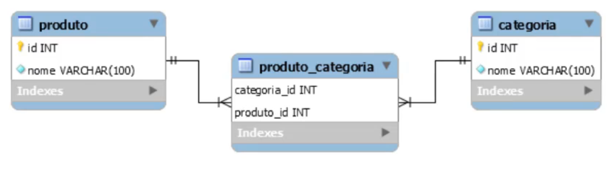

# especialistaJpa

## Relacionamentos

### Tipos
- Muitos para um
- Um para muitos
- Um para um
- Muitos para muitos

#### Muitos pra um


#### Um para muitos


#### Um pra um


#### Muitos pra Muitos





### Mapeamento Bidirecional

> Inda: **List<Categoria> categorias**


> Volta: **@ManyToMany(mappedBy= ...)**

### Owner e Non-Owning
- Dono e não dono do mapeamento

> Dono que utiliza **@JoinTable ou @JoinColumn ou quem utiliza o contrário de mappedBy**

> Quem persiste a relação é o *Owner*


### Estratégias para gerar ID
- Hibernate escolhe a forma, ele cria a tabela hibernate_sequence

```
@Id
@GeneratedValue(strategy = GenerationType.AUTO)
private Integer id;
```

- Ele gera uma sequence

```
@Id
@GeneratedValue(strategy = GenerationType.SEQUENCE, generator = "seq_cat")
@SequenceGenerator(name = "seq_cat", sequenceName = "seq_chave_primary_cat")
private Integer id;
```

- ele cria a tabela hibernate_sequences, ele vai com chave primaria  e o próximo valor

```
@Id
@GeneratedValue(strategy = GenerationType.TABLE, generator = "tabela")
@TableGenerator(name = "tabela", table = "hibernate_sequences",
            pkColumnName = "sequence_name", pkColumnValue = "categoria",
            valueColumnName = "next_val", initialValue = 0, allocationSize = 1)
private Integer id;
```

- auto incremento

```
@Id
@GeneratedValue(strategy = GenerationType.IDENTITY)
private Integer id;
```

#### Teste Pedidos com Itens EAGER
```
 select pedido0_.id as id1_9_0_, pedido0_.cliente_id as cliente14_9_0_, pedido0_.data_conclusao as data_con2_9_0_, pedido0_.data_pedido as data_ped3_9_0_, pedido0_.bairro as bairro4_9_0_, pedido0_.cep as cep5_9_0_, pedido0_.cidade as cidade6_9_0_, pedido0_.complemento as compleme7_9_0_, pedido0_.estado as estado8_9_0_, pedido0_.logradouro as logradou9_9_0_, pedido0_.numero as numero10_9_0_, pedido0_.nota_fiscal_id as nota_fi11_9_0_, pedido0_.status as status12_9_0_, pedido0_.total as total13_9_0_, pedido0_1_.nota_fiscal_id as nota_fis0_0_0_,
        cliente1_.id as id1_3_1_, cliente1_.nome as nome2_3_1_, cliente1_.sexo as sexo3_3_1_,
        pagamentoc2_.id as id1_7_2_, pagamentoc2_.numero as numero2_7_2_, pagamentoc2_.pedido_id as pedido_i4_7_2_, pagamentoc2_.status_pagamento as status_p3_7_2_,
        notafiscal3_.id as id1_6_3_,notafiscal3_.data_emissao as data_emi2_6_3_,notafiscal3_.xml as xml3_6_3_,notafiscal3_1_.pedido_id as pedido_i1_0_3_,pedido4_.id as id1_9_4_,pedido4_.cliente_id as cliente14_9_4_,pedido4_.data_conclusao as data_con2_9_4_,pedido4_.data_pedido as data_ped3_9_4_,pedido4_.bairro as bairro4_9_4_,pedido4_.cep as cep5_9_4_,pedido4_.cidade as cidade6_9_4_,pedido4_.complemento as compleme7_9_4_,pedido4_.estado as estado8_9_4_,pedido4_.logradouro as logradou9_9_4_,pedido4_.numero as numero10_9_4_,pedido4_.nota_fiscal_id as nota_fi11_9_4_,pedido4_.status as status12_9_4_,pedido4_.total as total13_9_4_,
        pedido4_1_.nota_fiscal_id as nota_fis0_0_4_ 
    from tb_pedido pedido0_ 
    left outer join pedido_nota_fiscal pedido0_1_  on pedido0_.id=pedido0_1_.pedido_id 
    left outer join tb_cliente cliente1_  on pedido0_.cliente_id=cliente1_.id 
    left outer join tb_pagamento_cartao pagamentoc2_  on pedido0_.id=pagamentoc2_.pedido_id 
    left outer join tb_nota_fiscal notafiscal3_  on pedido0_1_.nota_fiscal_id=notafiscal3_.id 
    left outer join pedido_nota_fiscal notafiscal3_1_  on notafiscal3_.id=notafiscal3_1_.nota_fiscal_id 
    left outer join tb_pedido pedido4_  on notafiscal3_1_.pedido_id=pedido4_.id 
    left outer join pedido_nota_fiscal pedido4_1_  on pedido4_.id=pedido4_1_.pedido_id 
    where pedido0_.id=?
```

#### Teste Pedidos com Itens LAZY
```
select
        pedido0_.id as id1_9_0_,pedido0_.cliente_id as cliente14_9_0_,pedido0_.data_conclusao as data_con2_9_0_,pedido0_.data_pedido as data_ped3_9_0_,pedido0_.bairro as bairro4_9_0_,pedido0_.cep as cep5_9_0_,pedido0_.cidade as cidade6_9_0_,pedido0_.complemento as compleme7_9_0_,pedido0_.estado as estado8_9_0_,pedido0_.logradouro as logradou9_9_0_,pedido0_.numero as numero10_9_0_,pedido0_.nota_fiscal_id as nota_fi11_9_0_,pedido0_.status as status12_9_0_,pedido0_.total as total13_9_0_,pedido0_1_.nota_fiscal_id as nota_fis0_0_0_,
        
        cliente1_.id as id1_3_1_, cliente1_.nome as nome2_3_1_, cliente1_.sexo as sexo3_3_1_,
        
        itens2_.pedido_id as pedido_i4_5_2_,itens2_.id as id1_5_2_,itens2_.id as id1_5_3_,itens2_.pedido_id as pedido_i4_5_3_,itens2_.preco_produto as preco_pr2_5_3_,itens2_.produto_id as produto_5_5_3_,itens2_.quantidade as quantida3_5_3_,
        
        produto3_.id as id1_10_4_,produto3_.descricao as descrica2_10_4_,produto3_.nome as nome3_10_4_,produto3_.preco as preco4_10_4_,
        
        pagamentoc4_.id as id1_7_5_,pagamentoc4_.numero as numero2_7_5_,pagamentoc4_.pedido_id as pedido_i4_7_5_,pagamentoc4_.status_pagamento as status_p3_7_5_,
        
        notafiscal5_.id as id1_6_6_,notafiscal5_.data_emissao as data_emi2_6_6_,notafiscal5_.xml as xml3_6_6_,notafiscal5_1_.pedido_id as pedido_i1_0_6_,
        
        pedido6_.id as id1_9_7_,pedido6_.cliente_id as cliente14_9_7_,pedido6_.data_conclusao as data_con2_9_7_,pedido6_.data_pedido as data_ped3_9_7_,pedido6_.bairro as bairro4_9_7_,pedido6_.cep as cep5_9_7_,pedido6_.cidade as cidade6_9_7_,pedido6_.complemento as compleme7_9_7_,pedido6_.estado as estado8_9_7_,pedido6_.logradouro as logradou9_9_7_,pedido6_.numero as numero10_9_7_,pedido6_.nota_fiscal_id as nota_fi11_9_7_,pedido6_.status as status12_9_7_,pedido6_.total as total13_9_7_,pedido6_1_.nota_fiscal_id as nota_fis0_0_7_ 
    from tb_pedido pedido0_ 
    left outer join pedido_nota_fiscal pedido0_1_ on pedido0_.id=pedido0_1_.pedido_id 
    left outer join tb_cliente cliente1_ on pedido0_.cliente_id=cliente1_.id 
    left outer join tb_item_pedido itens2_ on pedido0_.id=itens2_.pedido_id 
    left outer join tb_produto produto3_ on itens2_.produto_id=produto3_.id 
    left outer join tb_pagamento_cartao pagamentoc4_ on pedido0_.id=pagamentoc4_.pedido_id 
    left outer join tb_nota_fiscal notafiscal5_ on pedido0_1_.nota_fiscal_id=notafiscal5_.id 
    left outer join pedido_nota_fiscal notafiscal5_1_ on notafiscal5_.id=notafiscal5_1_.nota_fiscal_id 
    left outer join tb_pedido pedido6_ on notafiscal5_1_.pedido_id=pedido6_.id 
    left outer join pedido_nota_fiscal pedido6_1_ on pedido6_.id=pedido6_1_.pedido_id 
    where pedido0_.id=?
```

### Atributo Optional
- Ao salvar entidade
 - Se ao salvar precisa de uma outra entidade obrigatória, então colocar o `optional = false` da mais performance
 - Diz ao hibernate que ele pode usar um `inner join` ou invés de um `left out join`
- Entidade Pedido
    - @ManyToOne
    - @JoinColumn(name = "cliente_id")
    - private Cliente cliente; 

```
left outer join
        tb_cliente cliente1_ 
            on pedido0_.cliente_id=cliente1_.id 
```
- Entidade Pedido
    - @ManyToOne(optional = false)
    - @JoinColumn(name = "cliente_id")
    - private Cliente cliente; 
    
```
inner join
        tb_cliente cliente1_ 
            on pedido0_.cliente_id=cliente1_.id 
```