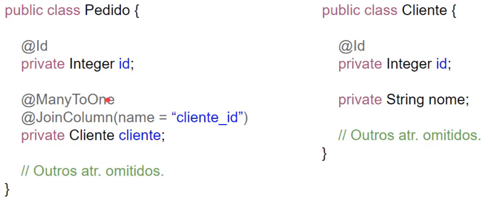

# especialistaJpa

## Relacionamentos

### Tipos
- Muitos para um
- Um para muitos
- Um para um
- Muitos para muitos

#### Muitos pra um




#### Um para muitos


#### Um pra um


#### Muitos pra Muitos


### Mapeamento Bidirecional

> Inda: **List<Categoria> categorias**


> Volta: **@ManyToMany(mappedBy= ...)**

### Owner e Non-Owning
- Dono e não dono do mapeamento

> Dono que utiliza **@JoinTable ou @JoinColumn ou quem utiliza o contrário de mappedBy**

> Quem persiste a relação é o *Owner*


### Estratégias para gerar ID
- Hibernate escolhe a forma, ele cria a tabela hibernate_sequence

```
@Id
@GeneratedValue(strategy = GenerationType.AUTO)
private Integer id;
```

- Ele gera uma sequence

```
@Id
@GeneratedValue(strategy = GenerationType.SEQUENCE, generator = "seq_cat")
@SequenceGenerator(name = "seq_cat", sequenceName = "seq_chave_primary_cat")
private Integer id;
```

- ele cria a tabela hibernate_sequences, ele vai com chave primaria  e o próximo valor

```
@Id
@GeneratedValue(strategy = GenerationType.TABLE, generator = "tabela")
@TableGenerator(name = "tabela", table = "hibernate_sequences",
            pkColumnName = "sequence_name", pkColumnValue = "categoria",
            valueColumnName = "next_val", initialValue = 0, allocationSize = 1)
private Integer id;
```

- auto incremento

```
@Id
@GeneratedValue(strategy = GenerationType.IDENTITY)
private Integer id;
```

#### Teste Pedidos com Itens EAGER
```
 select pedido0_.id as id1_9_0_, pedido0_.cliente_id as cliente14_9_0_, pedido0_.data_conclusao as data_con2_9_0_, pedido0_.data_pedido as data_ped3_9_0_, pedido0_.bairro as bairro4_9_0_, pedido0_.cep as cep5_9_0_, pedido0_.cidade as cidade6_9_0_, pedido0_.complemento as compleme7_9_0_, pedido0_.estado as estado8_9_0_, pedido0_.logradouro as logradou9_9_0_, pedido0_.numero as numero10_9_0_, pedido0_.nota_fiscal_id as nota_fi11_9_0_, pedido0_.status as status12_9_0_, pedido0_.total as total13_9_0_, pedido0_1_.nota_fiscal_id as nota_fis0_0_0_,
        cliente1_.id as id1_3_1_, cliente1_.nome as nome2_3_1_, cliente1_.sexo as sexo3_3_1_,
        pagamentoc2_.id as id1_7_2_, pagamentoc2_.numero as numero2_7_2_, pagamentoc2_.pedido_id as pedido_i4_7_2_, pagamentoc2_.status_pagamento as status_p3_7_2_,
        notafiscal3_.id as id1_6_3_,notafiscal3_.data_emissao as data_emi2_6_3_,notafiscal3_.xml as xml3_6_3_,notafiscal3_1_.pedido_id as pedido_i1_0_3_,pedido4_.id as id1_9_4_,pedido4_.cliente_id as cliente14_9_4_,pedido4_.data_conclusao as data_con2_9_4_,pedido4_.data_pedido as data_ped3_9_4_,pedido4_.bairro as bairro4_9_4_,pedido4_.cep as cep5_9_4_,pedido4_.cidade as cidade6_9_4_,pedido4_.complemento as compleme7_9_4_,pedido4_.estado as estado8_9_4_,pedido4_.logradouro as logradou9_9_4_,pedido4_.numero as numero10_9_4_,pedido4_.nota_fiscal_id as nota_fi11_9_4_,pedido4_.status as status12_9_4_,pedido4_.total as total13_9_4_,
        pedido4_1_.nota_fiscal_id as nota_fis0_0_4_ 
    from tb_pedido pedido0_ 
    left outer join pedido_nota_fiscal pedido0_1_  on pedido0_.id=pedido0_1_.pedido_id 
    left outer join tb_cliente cliente1_  on pedido0_.cliente_id=cliente1_.id 
    left outer join tb_pagamento_cartao pagamentoc2_  on pedido0_.id=pagamentoc2_.pedido_id 
    left outer join tb_nota_fiscal notafiscal3_  on pedido0_1_.nota_fiscal_id=notafiscal3_.id 
    left outer join pedido_nota_fiscal notafiscal3_1_  on notafiscal3_.id=notafiscal3_1_.nota_fiscal_id 
    left outer join tb_pedido pedido4_  on notafiscal3_1_.pedido_id=pedido4_.id 
    left outer join pedido_nota_fiscal pedido4_1_  on pedido4_.id=pedido4_1_.pedido_id 
    where pedido0_.id=?
```

#### Teste Pedidos com Itens LAZY
```
select
        pedido0_.id as id1_9_0_,pedido0_.cliente_id as cliente14_9_0_,pedido0_.data_conclusao as data_con2_9_0_,pedido0_.data_pedido as data_ped3_9_0_,pedido0_.bairro as bairro4_9_0_,pedido0_.cep as cep5_9_0_,pedido0_.cidade as cidade6_9_0_,pedido0_.complemento as compleme7_9_0_,pedido0_.estado as estado8_9_0_,pedido0_.logradouro as logradou9_9_0_,pedido0_.numero as numero10_9_0_,pedido0_.nota_fiscal_id as nota_fi11_9_0_,pedido0_.status as status12_9_0_,pedido0_.total as total13_9_0_,pedido0_1_.nota_fiscal_id as nota_fis0_0_0_,
        
        cliente1_.id as id1_3_1_, cliente1_.nome as nome2_3_1_, cliente1_.sexo as sexo3_3_1_,
        
        itens2_.pedido_id as pedido_i4_5_2_,itens2_.id as id1_5_2_,itens2_.id as id1_5_3_,itens2_.pedido_id as pedido_i4_5_3_,itens2_.preco_produto as preco_pr2_5_3_,itens2_.produto_id as produto_5_5_3_,itens2_.quantidade as quantida3_5_3_,
        
        produto3_.id as id1_10_4_,produto3_.descricao as descrica2_10_4_,produto3_.nome as nome3_10_4_,produto3_.preco as preco4_10_4_,
        
        pagamentoc4_.id as id1_7_5_,pagamentoc4_.numero as numero2_7_5_,pagamentoc4_.pedido_id as pedido_i4_7_5_,pagamentoc4_.status_pagamento as status_p3_7_5_,
        
        notafiscal5_.id as id1_6_6_,notafiscal5_.data_emissao as data_emi2_6_6_,notafiscal5_.xml as xml3_6_6_,notafiscal5_1_.pedido_id as pedido_i1_0_6_,
        
        pedido6_.id as id1_9_7_,pedido6_.cliente_id as cliente14_9_7_,pedido6_.data_conclusao as data_con2_9_7_,pedido6_.data_pedido as data_ped3_9_7_,pedido6_.bairro as bairro4_9_7_,pedido6_.cep as cep5_9_7_,pedido6_.cidade as cidade6_9_7_,pedido6_.complemento as compleme7_9_7_,pedido6_.estado as estado8_9_7_,pedido6_.logradouro as logradou9_9_7_,pedido6_.numero as numero10_9_7_,pedido6_.nota_fiscal_id as nota_fi11_9_7_,pedido6_.status as status12_9_7_,pedido6_.total as total13_9_7_,pedido6_1_.nota_fiscal_id as nota_fis0_0_7_ 
    from tb_pedido pedido0_ 
    left outer join pedido_nota_fiscal pedido0_1_ on pedido0_.id=pedido0_1_.pedido_id 
    left outer join tb_cliente cliente1_ on pedido0_.cliente_id=cliente1_.id 
    left outer join tb_item_pedido itens2_ on pedido0_.id=itens2_.pedido_id 
    left outer join tb_produto produto3_ on itens2_.produto_id=produto3_.id 
    left outer join tb_pagamento_cartao pagamentoc4_ on pedido0_.id=pagamentoc4_.pedido_id 
    left outer join tb_nota_fiscal notafiscal5_ on pedido0_1_.nota_fiscal_id=notafiscal5_.id 
    left outer join pedido_nota_fiscal notafiscal5_1_ on notafiscal5_.id=notafiscal5_1_.nota_fiscal_id 
    left outer join tb_pedido pedido6_ on notafiscal5_1_.pedido_id=pedido6_.id 
    left outer join pedido_nota_fiscal pedido6_1_ on pedido6_.id=pedido6_1_.pedido_id 
    where pedido0_.id=?
```

### Atributo Optional
- Ao salvar entidade
 - Se ao salvar precisa de uma outra entidade obrigatória, então colocar o `optional = false` da mais performance
 - Diz ao hibernate que ele pode usar um `inner join` ou invés de um `left out join`
- Entidade Pedido
    - @ManyToOne
    - @JoinColumn(name = "cliente_id")
    - private Cliente cliente; 

```
left outer join
        tb_cliente cliente1_ 
            on pedido0_.cliente_id=cliente1_.id 
```
- Entidade Pedido
    - @ManyToOne(optional = false)
    - @JoinColumn(name = "cliente_id")
    - private Cliente cliente; 
    
```
inner join
        tb_cliente cliente1_ 
            on pedido0_.cliente_id=cliente1_.id 
```

## 5. Conhecendo o EntityManager


- 5.1. Estados e ciclo de vida dos objetos

    - Transiante
        - Qualquer outro meio que não seja o JPA que instânciou
            - Pedido p = new Pedido();
    - Managed
        - Depois de pesistir
            - Pedido p = em.find(Pedido.class, 1L);
    - Removed
        - chamou o remover para uma entidade e depois tentou persistir a mesmo
    - Detached
        - Chamar clear() ou close()

- 5.3. Gerenciamento de transações
- 5.4. Funcionamento do método flush
- 5.5. Contexto de persistência e o dirty checking
- 5.6. Callbacks para eventos do ciclo de vida
- 5.7. Listeners para eventos do ciclo de vida

## 6. Mapeamento avançado
- 6.1. Conhecendo detalhes da anotação @Column
- 6.2. Exercício: anotação @Column
- 6.3. Mapeando chave composta com @IdClass
- 6.4. Exercício: usando @IdClass
- 6.5. Mapeando chave composta com @EmbeddedId
- 6.6. Mapeando chave primária e estrangeira na mesma coluna com @MapsId
- 6.7. Exercício: usando @MapsId
- 6.8. Declarando propriedades transientes com @Transient
- 6.9. Mapeando coleções de tipos básicos com @ElementCollection
- 6.10. Mapeando coleções de objetos embutidos com @ElementCollection
- 6.11. Mapeando mapas com @ElementCollection
- 6.12. Mapeando e persistindo dados de arquivos com @Lob
- 6.13. Exercício: persistindo fotos de produtos
- 6.14. Mapeando tabela secundária com @SecondaryTable
- 6.15. Mapeando herança com @MappedSuperclass
- 6.16. Entendendo a diferença entre estender uma entidade abstrata e usar a anotação @MappedSuperclass
- 6.17. Mapeando herança com estratégia de tabela única (single table)
- 6.18. Mapeando herança com estratégia de uma tabela por classe (table per class)
- 6.19. Mapeando herança com a estratégia Joined Table
- 6.20. Exercício: voltando o mapeando de herança para tabela única

## 7. Mapeando entidades para geração do DDL
- 7.1. Quando criar o schema do banco usando JPA?
- 7.2. Configurando detalhes da tabela com @Table
- 7.3. Exercício: usando @Table
- 7.4. Configurando colunas com @Column
- 7.5. Exercício: usando @Column
- 7.6. Corrigindo os testes do JUnit
- 7.7. Usando a anotação @Lob em strings
- 7.8. Configurando chaves estrangeiras com @JoinColumn
- 7.9. Exercício: usando @JoinColumn
- 7.10. Entendendo alguns detalhes de @JoinTable
- 7.11. Configurando tabelas secundárias com @SecondaryTable
- 7.12. Conhecendo as estratégias de schema generation
- 7.13. Gerando o schema do banco com arquivos de scripts SQL
- 7.14. Gerando o schema do banco com metadados e scripts
- 7.15. Exportando os scripts de schema generation para arquivos externos
- 7.16. Configurando propriedades da unidade de persistência dinamicamente para schema generation

## 8. Operações em cascata
- 8.1. Configurando operações em cascata
- 8.2. Fazendo inserções de objetos em cascata
- 8.3. Exercício: fazendo inserções em cascata
- 8.4. Fazendo atualizações em cascata
- 8.5. Exercício: fazendo atualizações em cascata
- 8.6. Fazendo remoções em cascata
- 8.7. Entendendo a remoção em cascata com @ManyToMany
- 8.8. Removendo objetos órfãos com a propriedade orphanRemoval
- 8.9. Quando configurar operações em cascata?

## 9. JPQL do básico ao avançado
- 9.1. Introdução à JPQL (Java Persistence Query Language)
- 9.2. Entendendo as diferenças entre TypedQuery e Query
- 9.3. Selecionando um atributo da entidade como retorno da consulta
- 9.4. Trabalhando com projeções
- 9.5. Trabalhando com projeções e DTO
- 9.6. Fazendo inner join entre as entidades
- 9.7. Usando left outer join
- 9.8. Fazendo o join e usando o fetch
- 9.9. Entendendo as Path Expressions
- 9.10. Exercício: consultando pedidos com produto específico
- 9.11. Passando parâmetros para as consultas
- 9.12. Usando expressão condicional like
- 9.13. Usando expressões condicionais is null e is empty
- 9.14. Usando expressões condicionais de maior e menor
- 9.15. Exercício: usando expressões de maior e menor com datas
- 9.16. Usando expressão condicional between
- 9.17. Usando expressão de diferente
- 9.18. Usando operadores lógicos
- 9.19. Ordenando os resultados da consulta
- 9.20. Fazendo paginação de resultados
- 9.21. Limitando a quantidade de registros retornados
- 9.22. Usando funções para strings
- 9.23. Usando funções para datas
- 9.24. Usando funções para números
- 9.25. Usando funções para coleções
- 9.26. Usando funções nativas
- 9.27. Usando funções de agregação
- 9.28. Agrupando o registros com group by
- 9.29. Exercício: usando group by
- 9.30. Usando a cláusula where com group by
- 9.31. Usando o having para condicionar o agrupamento
- 9.32. Usando a expressão case
- 9.33. Usando a expressão in
- 9.34. Usando o distinct para evitar duplicações
- 9.35. Criando subqueries
- 9.36. Criando subqueries com a expressão in
- 9.37. Criando subqueries com a expressão exists
- 9.38. Exercício: usando a expressão in
- 9.39. Exercício: criando subqueries
- 9.40. Exercício: criando subqueries com exists
- 9.41. Criando subqueries com all
- 9.42. Criando subqueries com any
- 9.43. Exercício: criando subqueries com all
- 9.44. Fazendo operações em lote
- 9.45. Atualizando objetos em lote
- 9.46. Removendo objetos em lote
- 9.47. Configurando uma dynamic query
- 9.48. Configurando uma query nomeada com @NamedQuery
- 9.49. Externalizando queries em um arquivo XML
- 9.50. Abordagem híbrida para dynamic e named queries

## 10. Criteria API do básico ao avançado
- 10.1. Introdução à Criteria API do JPA
- 10.2. Selecionando um atributo da entidade como retorno da consulta
- 10.3. Exercício: retornando todos os produtos
- 10.4. Trabalhando com projeções
- 10.5. Usando tuple para uma projeção
- 10.6. Trabalhando com projeções e DTO
- 10.7. Fazendo inner join entre as entidades
- 10.8. Usando a cláusula on no join
- 10.9. Usando left outer join
- 10.10. Fazendo o join e usando o fetch
- 10.11. Consultando pedidos com um produto específico
- 10.12. Passando parâmetros para as consultas
- 10.13. Tipagem forte com metamodel
- 10.14. Usando expressão condicional like
- 10.15. Usando as expressões condicionais is null e is empty
- 10.16. Usando expressões condicionais de maior e menor
- 10.17. Exercício: usando expressões de maior e menor com datas
- 10.18. Usando expressão condicional between
- 10.19. Usando expressão de diferente
- 10.20. Usando operadores lógicos
- 10.21. Ordenando os resultados da consulta
- 10.22. Fazendo paginação e limitando resultados
- 10.23. Usando funções para string
- 10.24. Usando funções para datas
- 10.25. Usando funções para números
- 10.26. Usando funções para coleções
- 10.27. Usando funções nativas
- 10.28. Usando funções de agregação
- 10.29. Agrupando registros com o group by
- 10.30. Exercício: usando group by
- 10.31. Diferença entre expressions, paths e predicates
- 10.32. Exercício: consultando pedidos com produto específico
- 10.33. Agrupando registros com funções no group by
- 10.34. Usando o having para condicionar o agrupamento
- 10.35. Usando a expressão case
- 10.36. Usando a expressão in
- 10.37. Usando distinct para evitar duplicações
- 10.38. Criando subqueries
- 10.39. Relacionando a subquery com a query principal
- 10.40. Criando subquery com a expressão in
- 10.41. Criando subquery com a expressão exists
- 10.42. Exercício: criando subqueries
- 10.43. Exercício: criando subqueries com in
- 10.44. Exercício: criando subqueries com exists
- 10.45. Criando subqueries com all
- 10.46. Criando subqueries com any
- 10.47. Exercício: criando subqueries com all
- 10.48. Atualizando objetos em lote
- 10.49. Removendo objetos em lote

## 11. Consultas nativas
- 11.1. Por que usar query nativa?
- 11.2. Executando SQL e retornando uma lista de arrays
- 11.3. Executando SQL e retornando uma entidade
- 11.4. Passando parâmetros para consulta nativa
- 11.5. Mapeando resultado de queries nativas com @SqlResultSetMapping
- 11.6. Usando @SqlResultSetMapping com @FieldResult
- 11.7. Usando @SqlResultSetMapping com @ColumnResult e retornando DTO
- 11.8. Usando uma @NamedNativeQuery
- 11.9. Adicionando consultas no arquivo XML
- 11.10. Exercício: mapeando retorno para um DTO
- 11.11. Invocando stored procedures com parâmetros in e out
- 11.12. Recebendo uma lista de registros da procedure
- 11.13. Exercício: atualizando registros com procedures
- 11.14. Configurando uma procedure com a anotação @NamedStoredProcedureQuery
- 11.15. Invocando uma view do banco de dados

## 12. Bean Validation, pool de conexões, Entity Graph e detalhes avançados
- 12.1. Validando objetos com Bean Validation
- 12.2. Exercício: validando objetos
- 12.3. Analisando anotações utilizadas
- 12.4. Entendendo o Pool de Conexões
- 12.5. Usando o HikariCP como gerenciador do pool de conexões
- 12.6. Buscando conexões de um nome JNDI
- 12.7. Criando um conversor de atributo
- 12.8. O problema do @OneToOne com o lazy no Hibernate
- 12.9. Entendendo e configurando um Entity Graph
- 12.10. Adicionando um Subgraph na consulta
- 12.11. Utilizando metamodel com Entity Graph
- 12.12. Configurando o Entity Graph através da anotação @NamedEntityGraph
- 12.13. Ajustando a configuração da entidade Pedido
- 12.14. Resolvendo o problema do N+1

## 13. Second Level Cache (cache compartilhado)
- 13.1. Entendendo o cache de segundo nível (ou shared cache)
- 13.2. Incluindo as entidades no cache
- 13.3. Removendo entidades do cache
- 13.4. Verificando se uma entidade está no cache
- 13.5. Modos de cache e a anotação @Cacheable
- 13.6. Fazendo controle dinâmico do cache
- 13.7. Configurando o EhCache como provedor
- 13.8. Fechando as instância de EntityManager dos exemplos de cache

## 14. Concorrência e locking
- 14.1. O que é concorrência e início da configuração dos exemplos
- 14.2. Resolvendo problemas de concorrência com Lock Otimista
- 14.3. Tipos que o atributo com @Version pode ter
- 14.4. Entendendo a diferença entre Lock Otimista e Lock Pessimista
- 14.5. Fazendo Lock Pessimista com PESSIMISTIC_READ
- 14.6. Fazendo Lock Pessimista com PESSIMISTIC_WRITE
- 14.7. Entendendo o que acontece se misturarmos mais de um tipo de lock
- 14.8. Outros tipos de lock
- 14.9. Lock com JPQL e Criteria API

## 5. Multitenancy
- 15.1. O que é Multitenancy (ou Multitenant) e os tipos de abordagem
- 15.2. Alteração na classe EntityManagerTest para melhorar a organização dos testes
- 15.3. Criando um novo schema no banco de dados
- 15.4. Implementando multitenancy com abordagem por schema
- 15.5. Implementando multitenancy com abordagem por máquina
- 15.6. Analisando uma aplicação web com Multitenant
- 15.7. Implementando multitenancy por coluna em uma aplicação web

## 16. PostgreSQL e EclipseLink
- 16.1. Instalando o PostgreSQL
- 16.2. Alterando as configurações para usar JPA com PostgreSQL
- 16.3. Alterando as configurações para usar EclipseLink como implementação do JPA

## 17. JPA em aplicações web
- 17.1. Reconhecendo o que aprendemos de JPA dentro de uma aplicação web 3m 17s
- 17.2. Configurando um projeto web com Spring MVC 16m 59s
- 17.3. Entendendo o JPA em um projeto com Spring MVC 22m 57s
- 17.4. Entendendo a camada de persistência 17m 0s
- 17.5. Configurando um projeto web com KumuluzEE 13m 43s
- 17.6. Entendendo o JPA em um projeto com KumuluzEE 7m 39s
- 17.7. Transações com RESOURCE_LOCAL vs JTA 10m 32s
- 17.8. Baixando e configurando o JBoss Wildfly 7m 41s
- 17.9. Publicando o projeto no JBoss Wildfly 10m 30s
- 17.10. Conclusão do curso e próximos passos 3m 46s